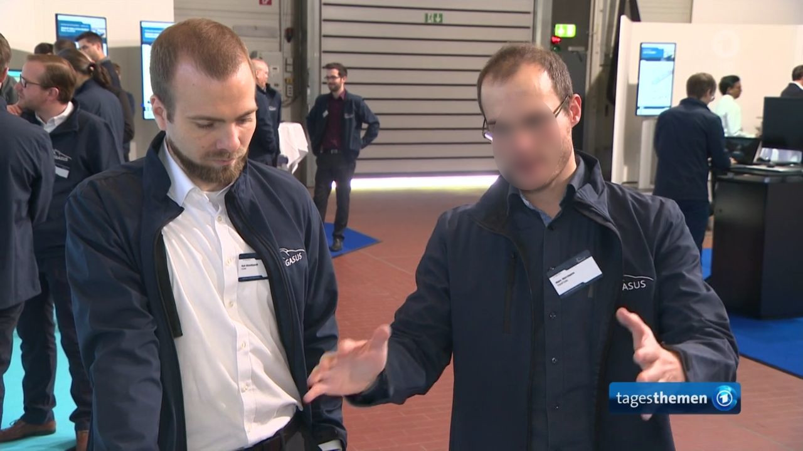
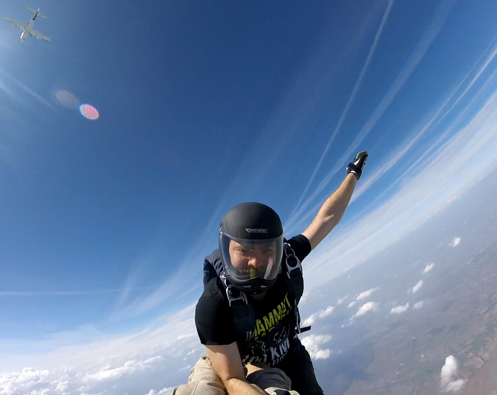
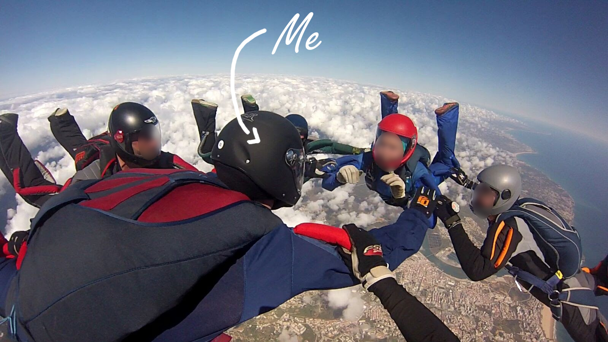
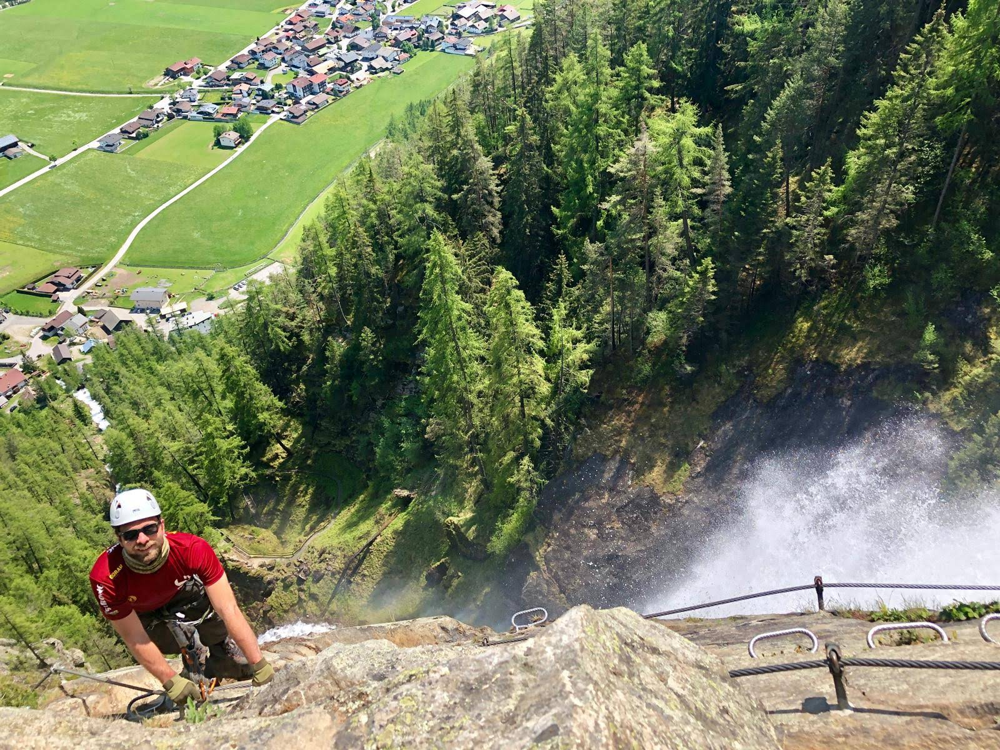
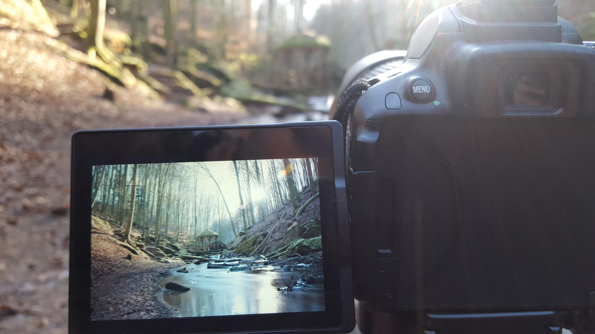
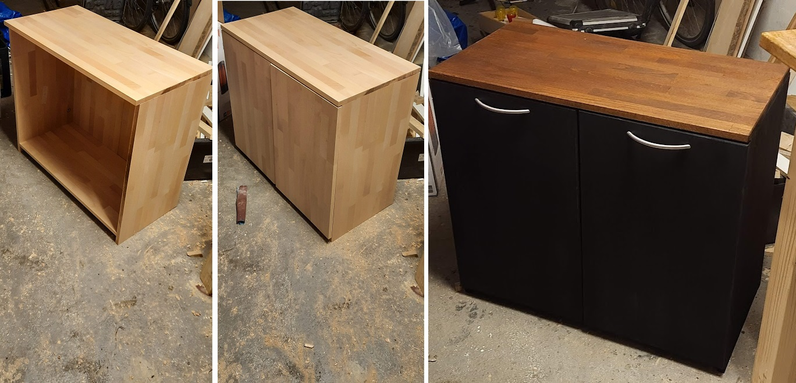

Hello,

I am Dr.-Ing. Kai Storms and you have found my personal webpage.
Please feel free to explore and send me a message if you find something of interest.

# Work
I see myself as a jack of all trades. I do a lot of software engineering, very often focused on data and artificial engineering.
My work also includes a strong focus on safety and systems engineering.
In my opinion, having an overview of the whole system/product with the ability to dive deep into selected topics of interest gives you the best chance to make an impact as an engineer.

Currently I am exploring the possibilities of Large Language Models / Foundation Models for data understanding.

I am focusing especially on vector embeddings and how they can help identintify and provide explanations for ADS failures.
Further I am looking into possible research routes to improve current data recording/processing procedures through pre-labeling/structuring by using foundation models.

My "5-Seconds of (national TV) Fame" 😉 from the PEGASUS final event:

# Personal
In my free time I love to persue one of my hobbies, of which I have accumulated more than enough over the years.

🪂 My longest standing hobby is skydiving, which I did get into through my father.

 

⛰️ During my student years I did some climbing throughout the alps (mostly Via Ferrata). This particular picture was taken at the [lehner waterfall in Längenfeld](https://www.bergfex.at/sommer/tirol/touren/klettersteig/116441,via-ferrata-lehner-wasserfall--laengenfeld/)

📷 Whenever I travel and I have anything that can take a picture with me, I love to do some landscape photography

🪵🪚 Woodworking is the newest addition, since it was a perfect COVID-cannot-leave-the-house-thing-to-do.

